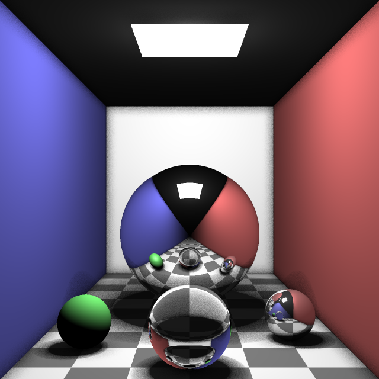
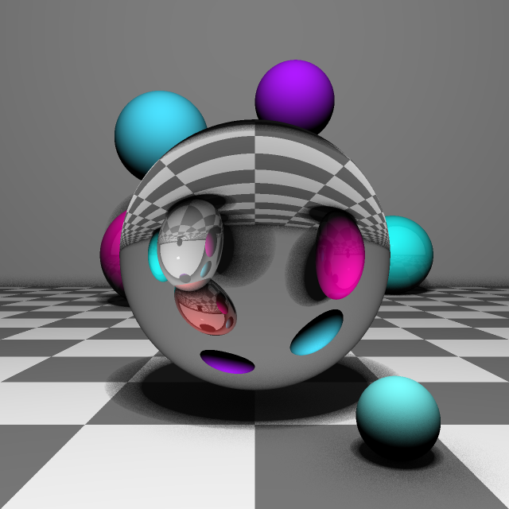

This a toy grade ray tracer written with JavaScript.

## Screenshots

A simple [Cornell'ish box](https://en.wikipedia.org/wiki/Cornell_box) with an area light illuminating four spheres:



Notice the soft shadows cast by the spheres, ambient occlusion outlining the corners of box, the mirror-like reflections of the large sphere and the refractive sphere at the front. 32 samples are cast for both soft shadows and ambient occlusion and each pixel uses 4 samples for supersampling.

Reflective spheres with a refractive sphere in the middle with sharp shadows:



## Features

* parallel rendering via WebWorkers
* sphere, plane and rectangle primitives
* recursive reflections
* recursive refractions
* sharp & soft shadows
* antialiasing using supersampling
* ambient occlusion
* scenes can be defined using JSON
* simple vector arithmetics library

## How to build

toy-tracer can be built using [parcel](https://parceljs.org/):

```bash
npm install
npm run build
```

You can find an example scene files under `/scenes`.

## Tests

A set of tests for mostly the math'y parts of the ray tracer can be executed with:

```
npm run test
```

## Why JavaScript? Why not GLSL?

Yes, I know computing on the GPU is the way to go for ray tracing as it's an [embarrassingly parallel](https://en.wikipedia.org/wiki/Embarrassingly_parallel) problem. However I wanted to write something relatively simple with JavaScript and WebWorkers and a ray tracer sounded like a good fit. Nevertheless if you do want to write a highly performing ray tracer which runs in the browser you should take a look at [Shader Toy](https://www.shadertoy.com/) and use WebGL / GLSL.

## License

MIT
